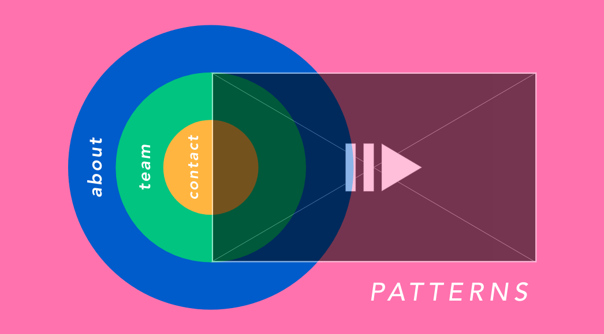

# P A T T E R N S 

Patterns is a short film on the intersection of art and our everyday lives. As part of the 30MFF at NYUAD, Patterns stands to tell the story of repeated instances in our daily lives that we tend to ignore. A little on the melancholic side, it explores artistic ways of understanding space through what can be classified as unrelated instances. 

We draw inspiration from the patterned posters around the CommLab classroom to create a backbone for our narrative. These posters sit infront of us during every class yet we overlook them as part of a static setting while we continue with our dynamic lives. *When does other people's dynamic living become a static in our world?*

## Process:

After coming up with and presenting the 30MFF site during our first class, it was time to make a wireframe for our website. Since I knew the website would be mine, I chose the colour scheme and the complete visuals of the site to work off of when the code comes. Creating a wireframe might have been one of my favourite parts as the initial planning made what came next much easier. I took inspiration from the repeated circles and colours on the posters we used as the backbone for my website. 

Three overlapping circles for the navigation and a rectangular content block is all it took for the website. I wanted it to be creative and to tell the story of the film as a complement to the idea not an afterthought. Here is an example of the main page of my wireframe, all my pages follow the exact same distribution as I wanted the main focus to be on the film rather than the information. 

As the coding started, it was fun yet frustrating to experiment with different settings and to find example code for the issues I encountered. CSS was much more of a hassle to breakdown than both HTML and JS. Styling the site came at the expense of serious positioning and centering therefore styling took the longest to create. I did, however, include and credit some open source code shared on the web to ease the workload for certain things such as the contact form. 

### Difficulties
